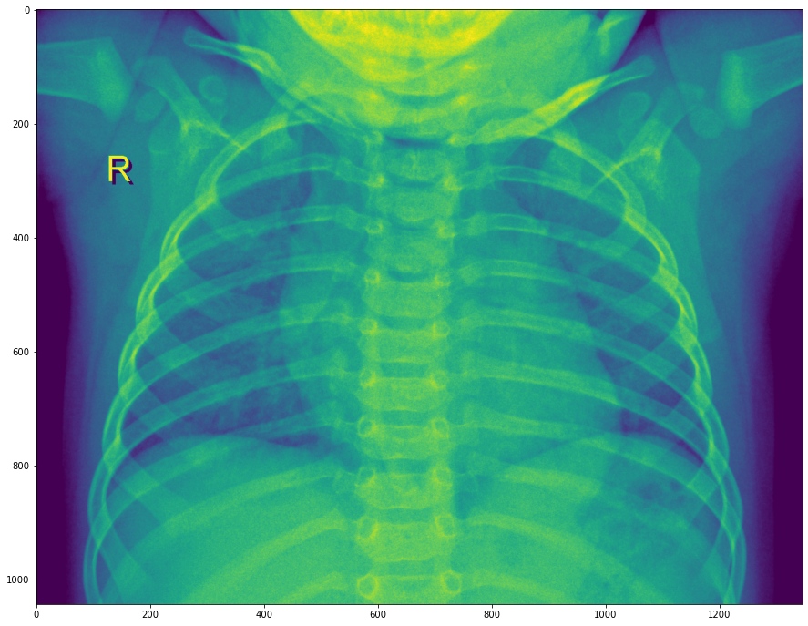
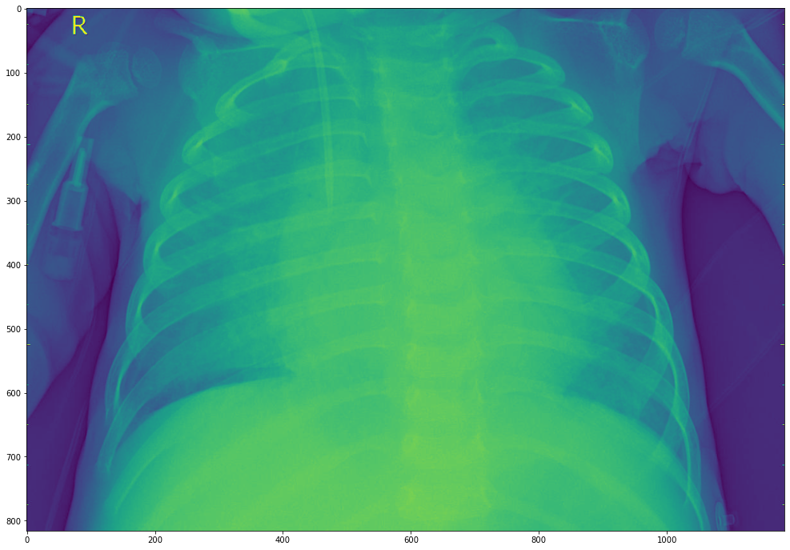

# Detecting Pneumonia in X-rays Using Image Classification Deep Neural Network

**Author:** Grant Edwards

## Overview

We are looking for a new way to help diagnose pneumonia in pediatric patients by using a deep neural network to automatically detect positive cases of pneumonia.

Pneumonia is a lung infection affecting the alveoli (air sacs located within the lungs).

X-rays can be used to detect and diagnose pneumonia in the lungs by exposing infiltrates (that appear as spots in the lungs) that can help identify infections. Diagnosing pneumonia can be difficult, even for physicians who are trained to identify and diagnose pneumonia, especially in early stages when the alveoli are not fully inflamed. Being able to have a trained image categorization neural network to identify and diagnose cases of pneumonia, in addendum to a doctor, can help reduce incorrect diagnosis.

***

## Business Problem

Goal: Build a image categorizer to detect pneumonia in x-rays
Detecting pneumonia in x-rays can be difficult
Incorrect diagnosis can lead to major health issues
Takes up physicians time

***

## Data

The images that we will be using to build a deep neural network are x-rays from pediatric patients that are broken into two classes of positive and negative for pneumonia. The images are also split into three groups for training, validation, and testing. The training x-rays will be used to train the model, validation will be used to validate the model as it trains through epochs. Testing x-rays will be used to see how the DNN performs on new images to simulate a real world trial. 



Image1: Negative for Pneumonia




Image2: Positive for Pneumonia


X-rays can be tricky to diagnose when not looking at something obvious like a broken bone, but pneumonia being a viral or bacterial infection causes inflammation in the respiratory organs (lungs). While there is going to be variability in the images as seen above, we can make out some distinctions such as increase distortion and spots in the lungs that can indicate pneumonia.
***

## Methods

We started by prepaering the data, making sure everything is either a float or integer, and that categorical data (like area code) are seperated into dummy columns. We then isolated our dependant (or target) variable, churn, and created train and testing dataset split to build and test our models and normalized our independent variables. We used confusion matrix, a mean cross validation (5 variable models), and returned the precision, recall, accuracy and F1-score for our models to see how they performed. 

For our first model we tried building with simple linear regression. 

We then tried build a decission tree and optimizing the tree. 

We then used a K-Nearest Neighbor model, pipeline methods and ensemble methods such as bagging, random forests, grid searches, gradient boost, adaboost, and xgboost. 


***

## Results

For the most significant variables we found that the total cost was the strongest feature in predicting if a customer would churn, followed by number of voicemails, anything retaining to international calling, and customer service calls.


***

For the linear regression model that we started with, we observed the following:

Precision Score: 0.4706

Recall Score: 0.1333

Accuracy Score: 0.8537

F1-Score: 0.2078

Mean Cross Validation: 0.6547


***

For the decission tree model, we observed the following:

Precision Score: 0.7846

Recall Score: 0.8500

Accuracy Score: 0.9448

F1-Score: 0.8160

Mean Cross Validation: 0.9616


***

For the optimized decission tree model, we observed the following by setting the max depth to 6 and the minimum samples per split to 12:

Precision Score: 0.9902

Recall Score: 0.8417

Accuracy Score: 0.9760

F1-Score: 0.9099

Mean Cross Validation: 0.9724


***

For the Ranodm Forest model, we observed the following by setting the max depth to 5, the max features to 10 and the number of estimators to 20:

Precision Score: 0.9904

Recall Score: 0.8583

Accuracy Score: 0.9784

F1-Score: 0.9196

Mean Cross Validation: 0.9700


***

The best performing model that we found, with confirmation from the cross validation, was a gradient boost model:

Precision Score: 0.9811

Recall Score: 0.8667

Accuracy Score: 0.9784

F1-Score: 0.9204

Mean Cross Validation: 0.9772


***

We also tried an XGBoost model, although it was slighlty behind the gradient boost model:

Precision Score: 0.9904

Recall Score: 0.8538

Accuracy Score: 0.9784

F1-Score: 0.9196

Mean Cross Validation: 0.9736


***

## Conclusions

The best performing model that we found, with confirmation from the cross validation, was a gradient boost model. It had a mean cross validation score of 97.72%, a recall score of 86.67%, a precision score of 98.11%, accuracy at 97.84%, and a F1-score of 92.04%.
 
The model had a couple of false positives, but mostly there were 16 false negatives. These false negatives were customers that churned, however the model could not predict them doing so. This was the lowest we were able to get any model while sticking with a random seed of 11 and is likely due to factors outside of our dataset that caused the customer to churn. People can be tricky to get a prediction on and what will make them want to drop a company’s services. Being able to accurately predict churning customers 86.7% is a great model and we can be confident that most, if not all, customers that are predicted to churn, will churn. This can make a useful tool for the company to help keep customer retention higher, by trying to work with the predicted churning customers to find what we can do to keep their business.
 
Unfortunately we did miss some churning customers, even when we focused the model to try and recall as many churning customers as possible. This can be due to many factors and as stated above people can be tricky to predict. There are many factors that can affect people and factors outside of the dataset that could cause the decision to influence people to drop our services. To understand what caused them to leave, we could reach out and see what the cause of their departures were.
 
To improve the model further, there could be opportunities to run more grid searches over different parameters, and work with more complex ensembles. This overall is a strong model that should help in identifying almost all churning customers and give the company an opportunity to reach out through a customer retention program to help prevent the customer from churning. 
***

## For More Information

Please review our full analysis in [our Jupyter Notebook](./tele-model.ipynb) or our [presentation](./tele-model-presentation.pdf).

For any additional questions, please contact **Grant Edwards, grantedwards11@gmail.com**

## Repository Structure

Describe the structure of your repository and its contents, for example:

```
├── README.md                           <- The top-level README for reviewers of this project
├── tele-model.ipynb               <- Narrative documentation of analysis in Jupyter notebook
├── tele-model-presentation.pdf        <- PDF version of project presentation
├── Data                                <- Both sourced externally and generated from code
└── images                              <- Generated from code
```
