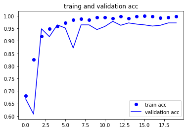
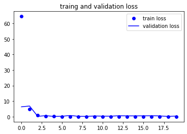
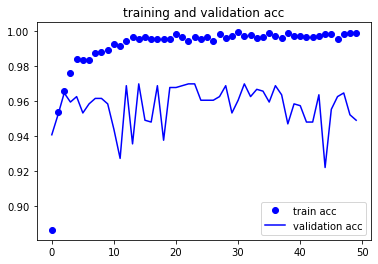
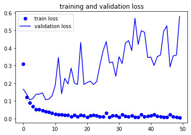
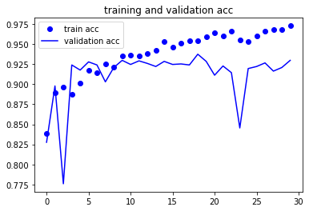
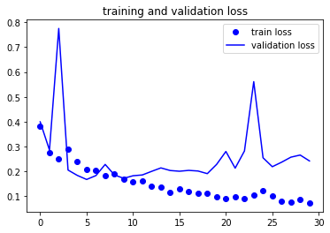

# Detecting Pneumonia in X-rays Using Image Classification Deep Neural Network

**Author:** Grant Edwards

## Overview

We are looking for a new way to help diagnose pneumonia in pediatric patients by using a deep neural network to automatically detect positive cases of pneumonia.

Pneumonia is a lung infection affecting the alveoli (air sacs located within the lungs).

X-rays can be used to detect and diagnose pneumonia in the lungs by exposing infiltrates (that appear as spots in the lungs) that can help identify infections. Diagnosing pneumonia can be difficult, even for physicians who are trained to identify and diagnose pneumonia, especially in early stages when the alveoli are not fully inflamed. Being able to have a trained image categorization neural network to identify and diagnose cases of pneumonia, in addendum to a doctor, can help reduce incorrect diagnosis.

***

## Business Problem

Goal: Build a image categorizer to detect pneumonia in x-rays
Detecting pneumonia in x-rays can be difficult
Incorrect diagnosis can lead to major health issues
Takes up physicians time

***

## Data

The x-ray images used were from kaggle: https://www.kaggle.com/datasets/paultimothymooney/chest-xray-pneumonia

The images that we will be using to build a deep neural network are x-rays from pediatric patients that are broken into two classes of positive and negative for pneumonia. The images are also split into three groups for training, validation, and testing. The training x-rays will be used to train the model, validation will be used to validate the model as it trains through epochs. Testing x-rays will be used to see how the DNN performs on new images to simulate a real world trial. 


Image1: Negative for Pneumonia


Image2: Positive for Pneumonia


X-rays can be tricky to diagnose when not looking at something obvious like a broken bone, but pneumonia being a viral or bacterial infection causes inflammation in the respiratory organs (lungs). While there is going to be variability in the images as seen above, we can make out some distinctions such as increase distortion and spots in the lungs that can indicate pneumonia.
***

## Methods

To start we checked the x-ray images, as well as the grouping. We found that the provided validation set had only 16 images, so the training set was split (70/30 training, validation respectively). This gave a large enough validation set to be useful. 
Next the ImageDataGenerator was set for the training, validation and testing sets, and models were built using different layers, depth and levels of complexity to try and find a strong model. 


***

## Results




Testing accuracy: 73.55%
Testing loss:	  6.355

The first model is decently accurate but has high loss. It is a good starting point. 
***



Testing accuracy: 76.44%
Testing loss:	  7.760

The next model saw an imporvment of the base in accuracy, but saw an increase in loss.
***



Testing accuracy: 88.62%
Testing loss:	  0.4472

The final model saw in significant increase in accuracy, while also having a low loss. 
Overall this model has performed well, accurately predicting whether or not the patient has pneumonia 88.62% of the time, with low loss of 0.4472. This was by far the top performing model that we made. However we ran this final model on the focus of a stringer recall score which we got 79.91%, meaning about 80% of all pnumonia cases were detected 
***

## Conclusions

This image categorization deep neural network model can be used to help diagnose cases of pneumonia, and can speed up diagnosing to reduce time spent by healthcare professionals, as well as help reduce incorrect diagnosis. In conjunction with more models and more complex models it could also be grown to potentially be used to diagnose a range of conditions within patients to help screen and find cases of ailments. Being able to diagnose cases of pneumonia can vastly increase the speed and accuracy of medical diagnosis in patience. Not only can the model reduce time spent by healthcare professionals, it can help get the proper medical care to patients earlier and help prevent more serious cases from developing. With an accuracy of 88% and a low loss score, we can feel very confident that we are getting the correct diagnosis.

Potential issues with building our model is human error. There is likely a way to improve the model further as well as there being potential mistakes in the training and validation images. Diagnosis early pneumonia can be difficult for trained physicians. It also would have been ideal if the validation data came in a significant quantity and we didn’t have to take from the training images.

***

## For More Information

Please review our full analysis in [our Jupyter Notebook](./X-Ray-Pneumonia.ipynb) or our [presentation](./X-Ray-Pneumonia-Presentation.pdf).

For any additional questions, please contact **Grant Edwards, grantedwards11@gmail.com**

## Repository Structure

Describe the structure of your repository and its contents, for example:

```
├── README.md                           <- The top-level README for reviewers of this project
├── X-Ray-Pneumonia.ipynb               <- Narrative documentation of analysis in Jupyter notebook
├── X-Ray-Pneumonia-Presentation.pdf    <- PDF version of project presentation
├── Data                                <- Both sourced externally and generated from code
└── images                              <- Generated from code
```
